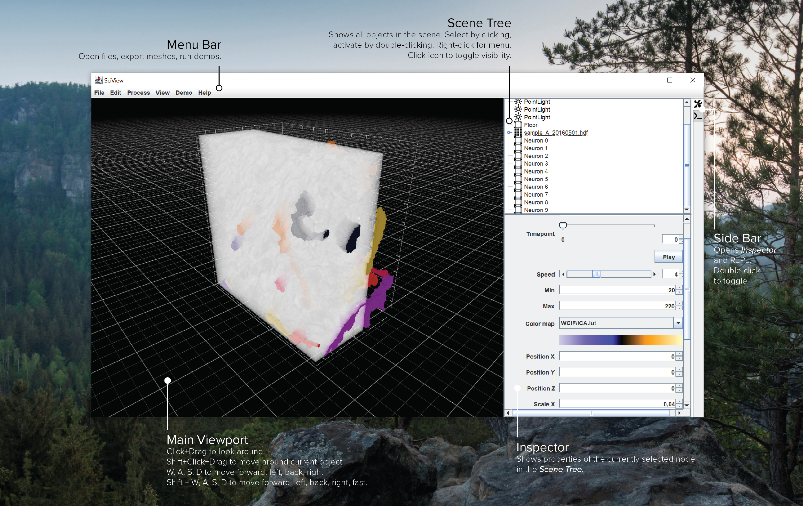

# Welcome

Welcome to the sciview documentation!

## Quick Help

### Navigation

| Shortcut | Action |
| :--- | :--- |
| `Click`+`Drag` | Look around the scene with fixed position. Works similar to looking around in a 3D shooter game. |
| `W`, `A`,`S`,`D` | Moves the camera forward, left, back and right. Just like a in a 3D game. |
| `Shift` +`W`, `A`,`S`,`D` | Moves the camera fast forward, left, back and right. Just like a in a 3D game. |
| `Shift`+`Click`+`Drag` | Circles the camera around the current object \(Arcball rotation\). |
| `Shift`+`Q` | Toggle debug visualisation for surface normals. |

