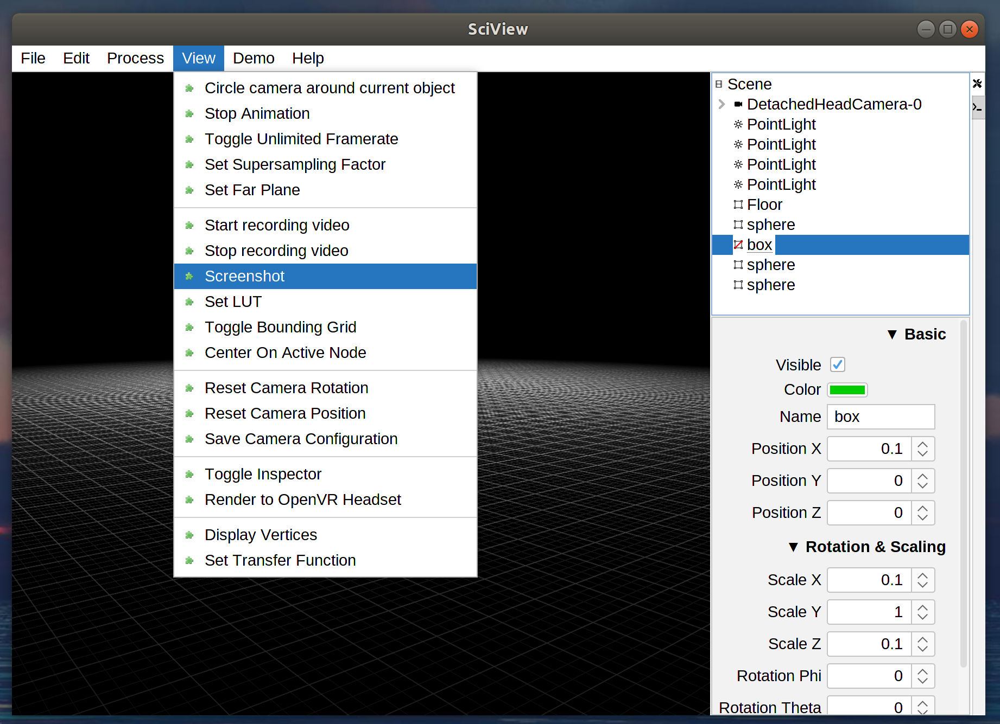

# First Scene

When you start sciview you have an empty scene:

You can now add a primitive object, like a sphere:

If you choose to add a sphere, then you will get a dialog where you can set the radius and color of the sphere:

Your sphere will be added to the scene:

You can then use the inspector to adjust properties of your new node. In this case,

* the color was set to magenta
* the position of the object was moved to 10 along the Y-xis
* the scale of the sphere was changed by a factor of 2, stretching it into an ellipse

Now let's add some more primitive shapes to make something fun:

Note that we can also interact with the scenegraph panel to do things like hiding nodes:

Now take a screenshot so you can distribute your beautiful work:

Great, you've got new material for your desktop wallpaper!

