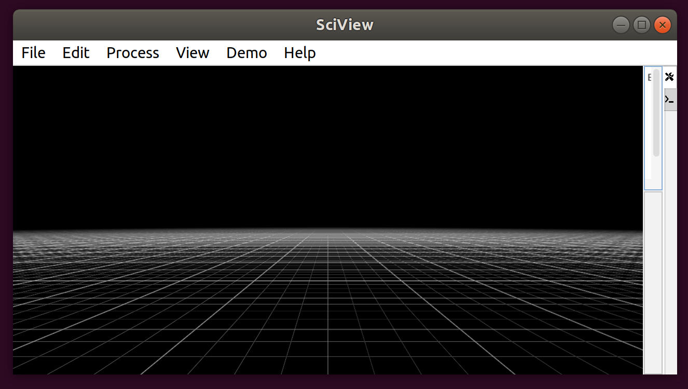
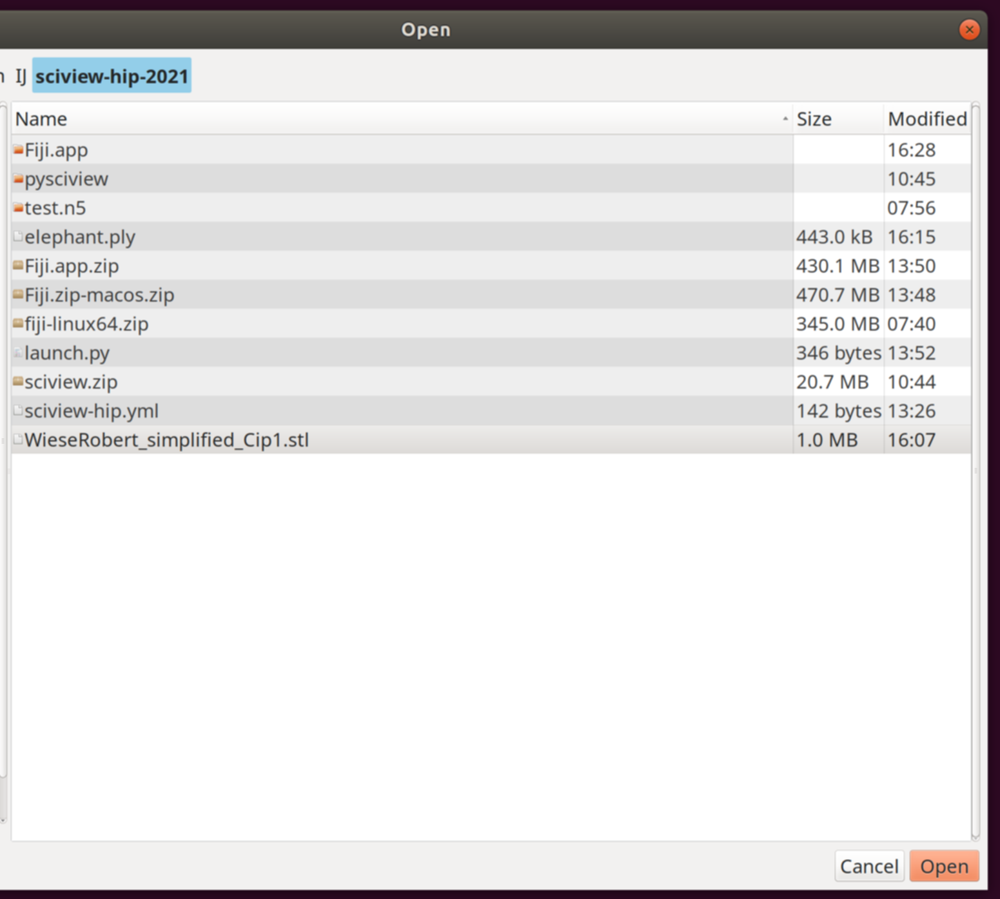
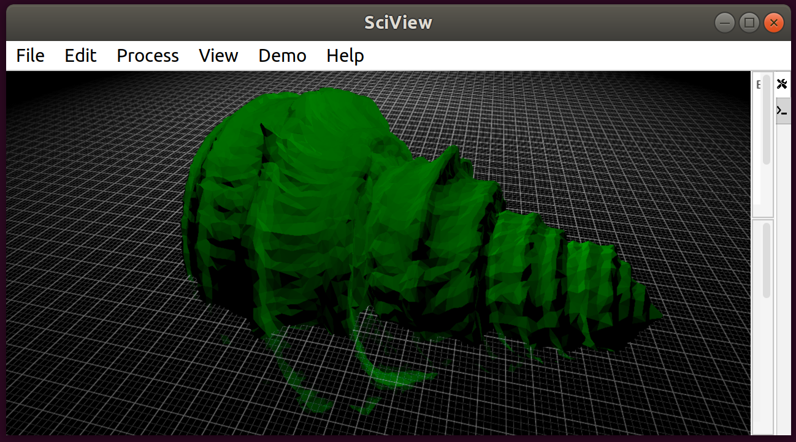
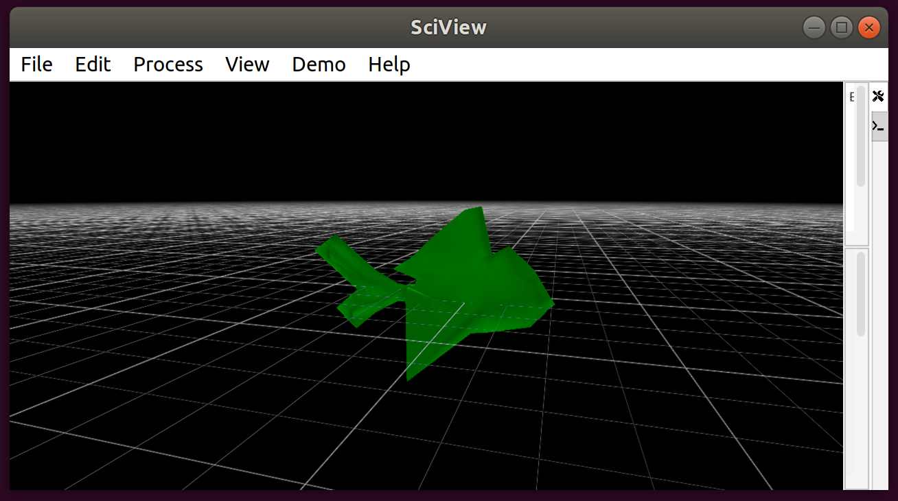

# Importing and exporting meshes

## Importing

sciview currently supports importing 2 mesh types: `stl` and `ply`

First, download [this stl mesh](https://github.com/scenerygraphics/sciview/raw/master/src/main/resources/WieseRobert_simplified_Cip1.stl) 
and [this ply mesh](https://github.com/scenerygraphics/sciview/raw/hip-summer-school-updates/src/main/resources/blub_control_mesh.ply)

Open your sciview window  
  

Now open the target mesh file `File>Open...`
  

Select either the `stl` or `ply` mesh that you just downloaded.

`stl`:  
  

`ply`:  
  

## Exporting

Now that you have your mesh already open, we can export it.  

Let's use the `stl` mesh that you imported (the `ply` file is missing
some information to correctly export).  

Select `File>Export>STL` to export into `stl` format. Choose the
location and enter the filename (you need to add the `.stl` extension
yourself).

