# Volumetric Data

Let's start with our trusty ImageJ toolbar and an empty sciview scene.

Now open the script editor by first clicking on the ImageJ toolbar then pressing "\[". Download and open this script in the script editor to generate a 3D image volume that we can use.

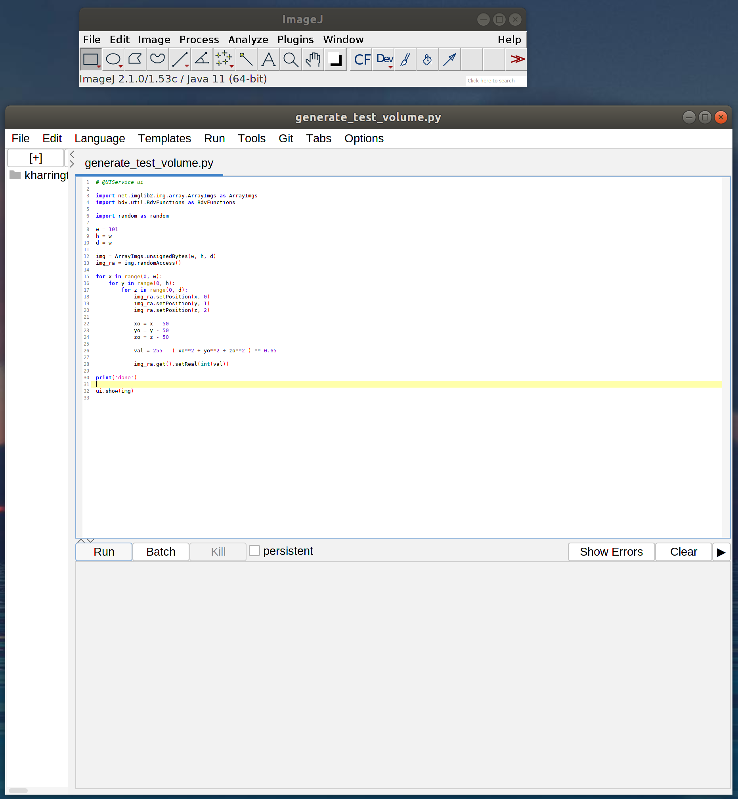

Now press "Run" or Ctrl + R

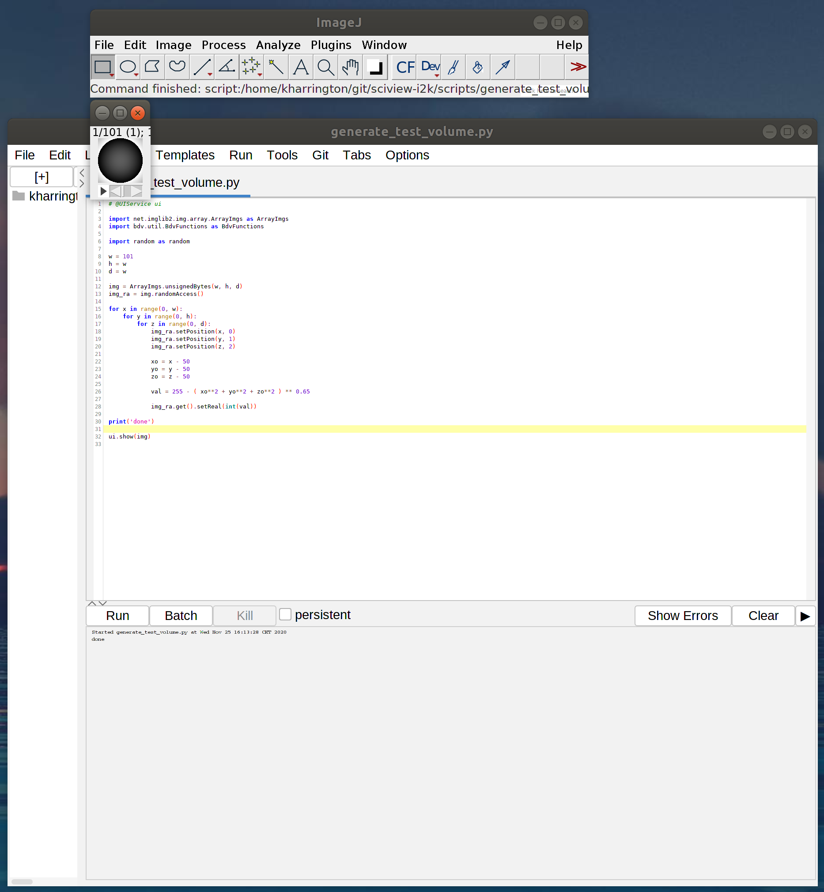

You can close the script editor, then "Add volume" in sciview.

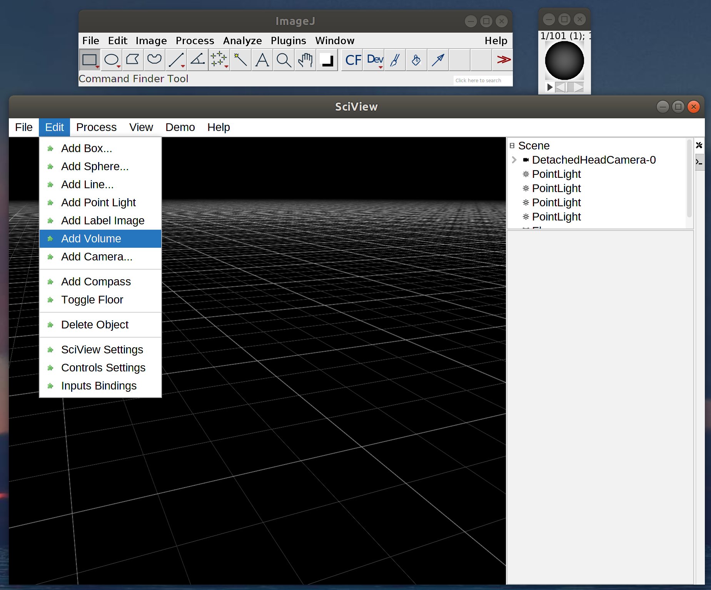

Then you will get a dialog where you can change the resolution of your volume's voxels (for example, if you are using confocal microscopy data, your z-resolution will be much larger)

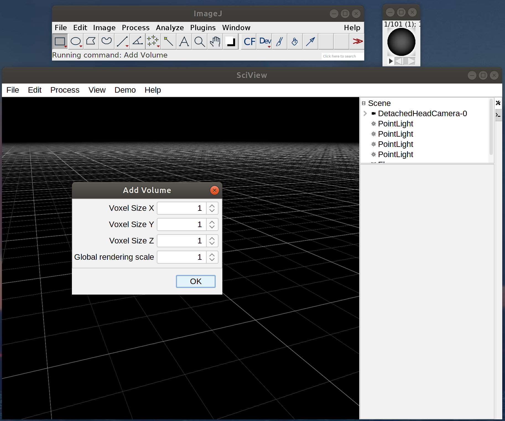

Your volume should open up in the sciview window

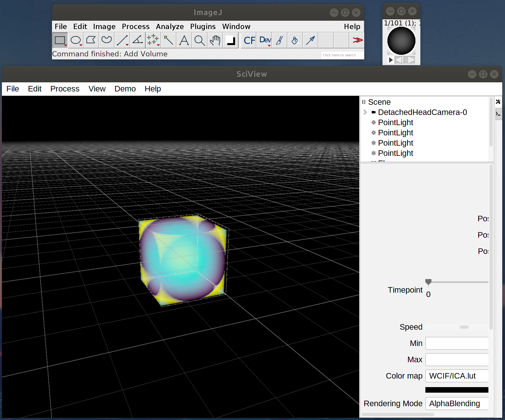

Now let's do something fun. Start an animation to circle around your volume

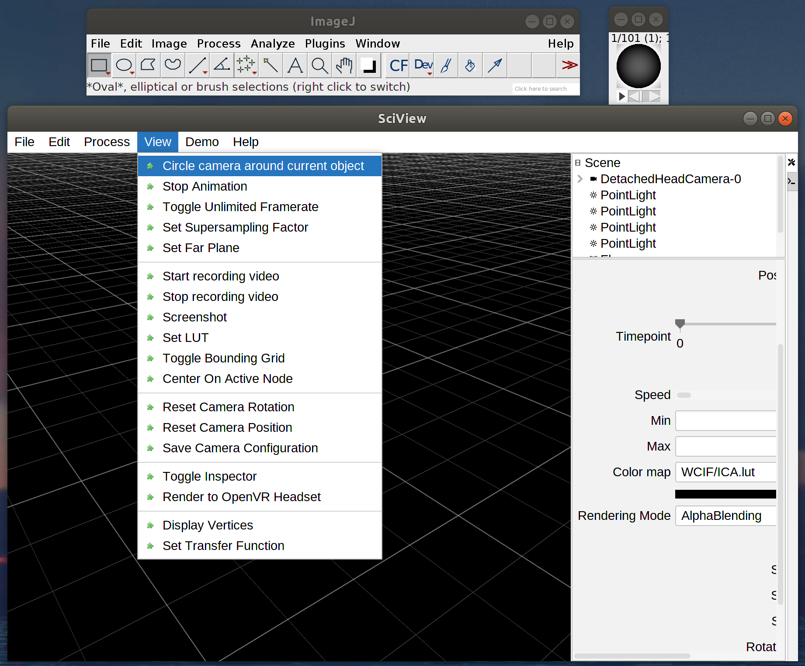

Start recording a video

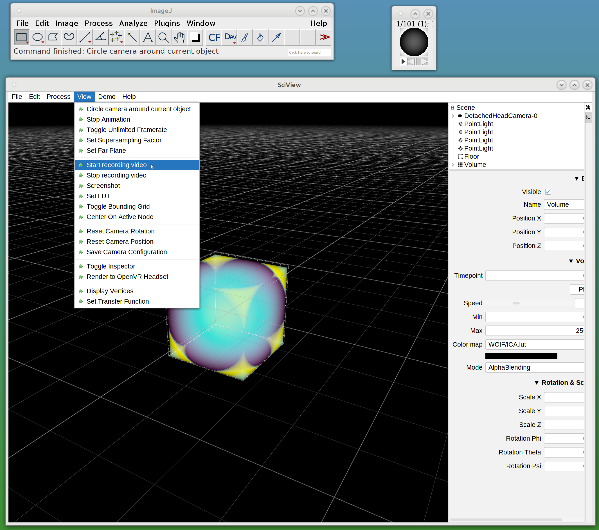

After some time, stop recording the video

## Changing colormap

Let's change the colormap of a volume

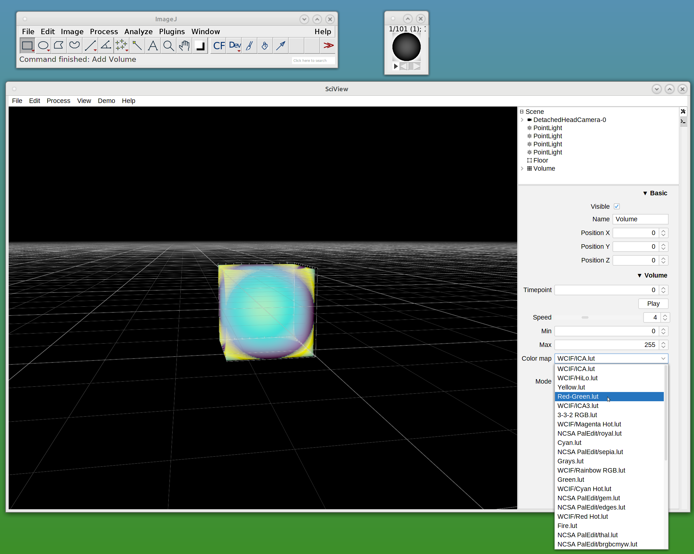

Voila, now we have a new colormap

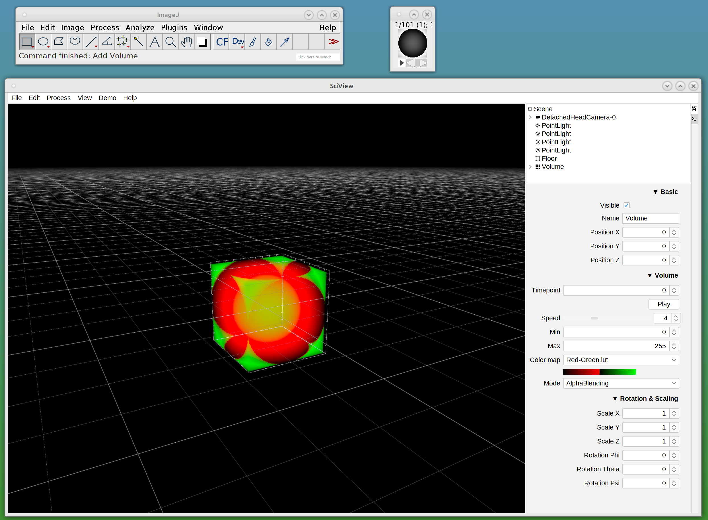

## Changing transfer function

Let's change the transfer function

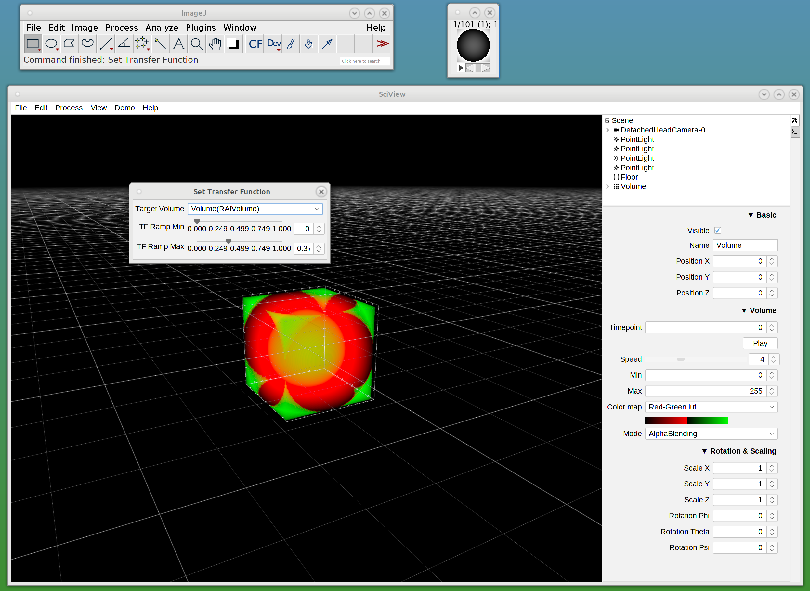

Voila, now we have a new transfer function

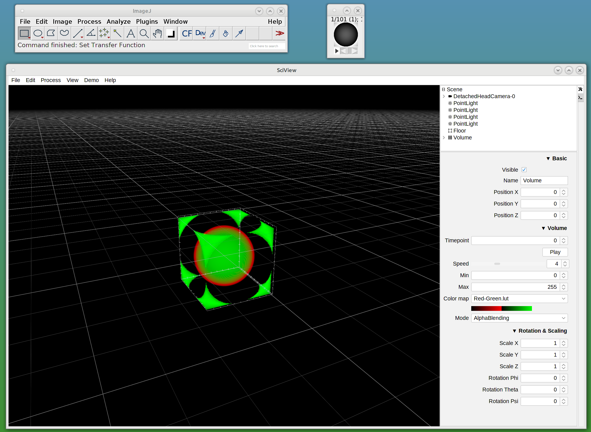

## What about timeseries?

No problem! Try the "Volume Timeseries" demo

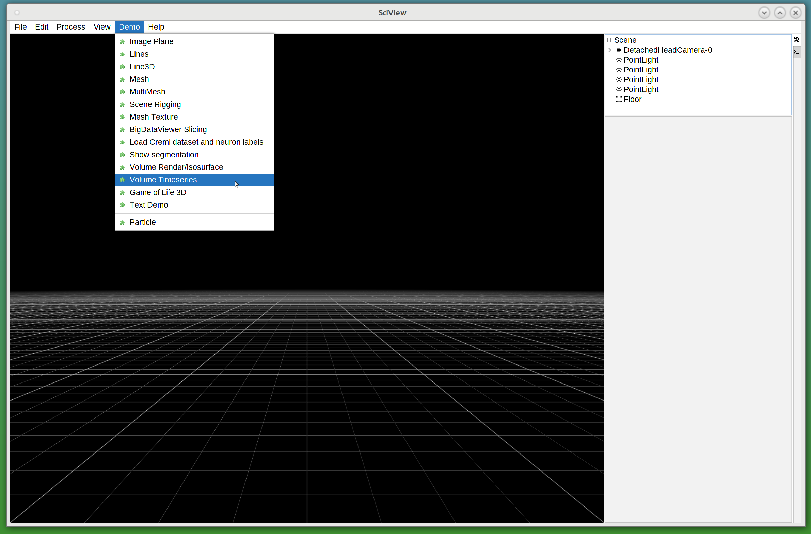

You'll get a volume that looks like this

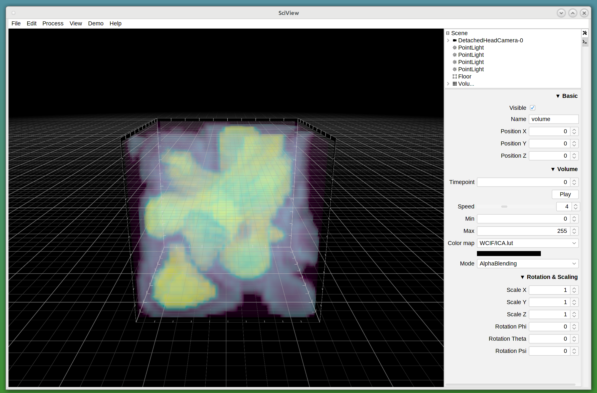

Now press play and enjoy

