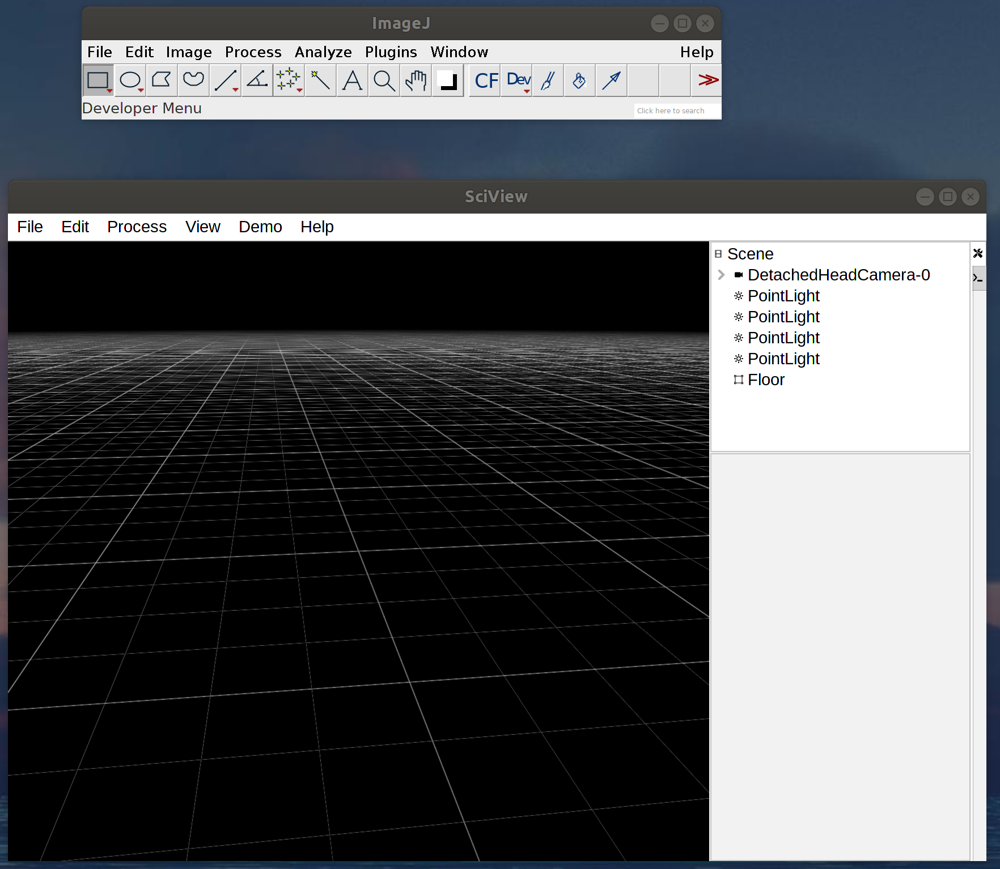
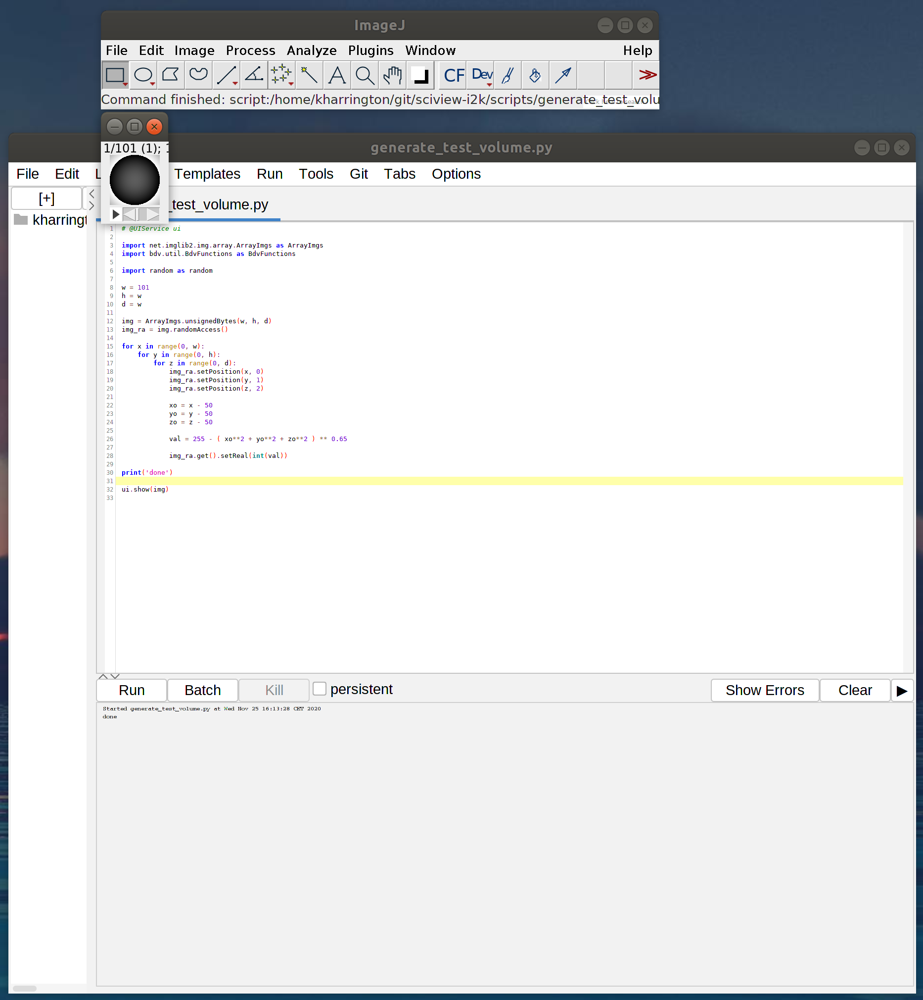
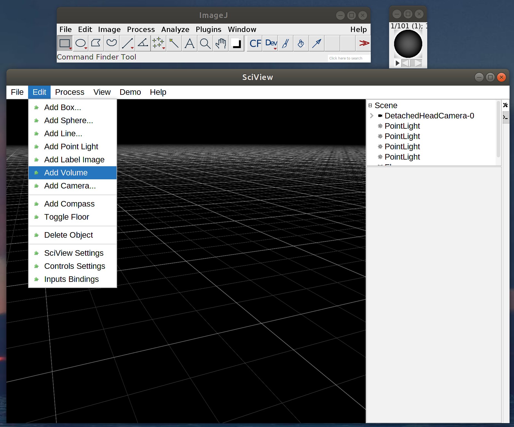
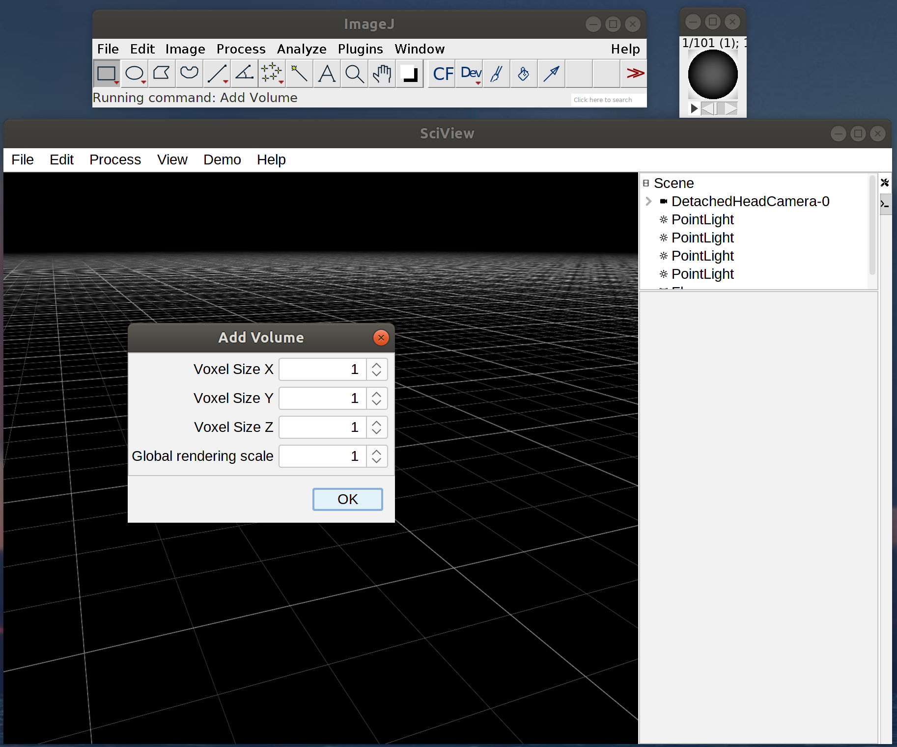
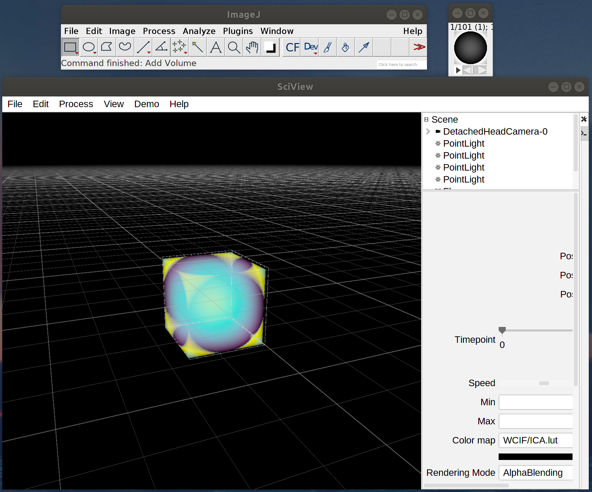
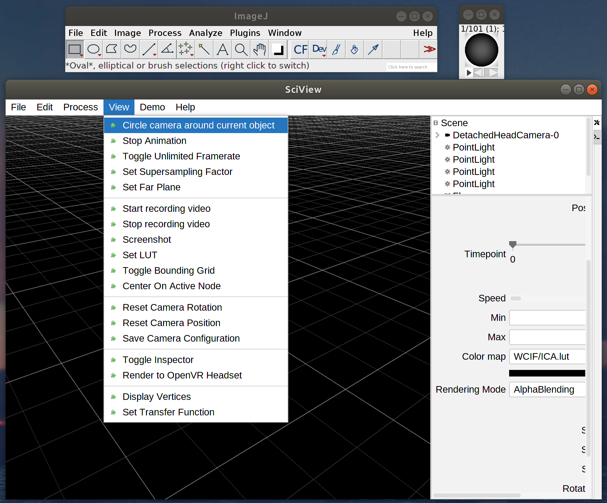

## Working with volumetric data

Let's start with our trusty ImageJ toolbar and an empty sciview scene.

Now open the script editor by first clicking on the ImageJ toolbar then pressing "[". Download and open this script in the sceipt editor to generate a 3D image volume that we can use

Now press "Run" or Ctrl + r

You can close the script editor, then "Add volume" in sciview.

Then you will get a dialog, where you can change the resolution of your volume's voxels (for example, if you are using confocal microscopy data your z-resolution will be much larger)

Your volume should open up in the sciview window

Now let's do something fun. Start an animation to circle around your volume

- Look up tables
- Transfer functions
- Timeseries
- Generative models?
