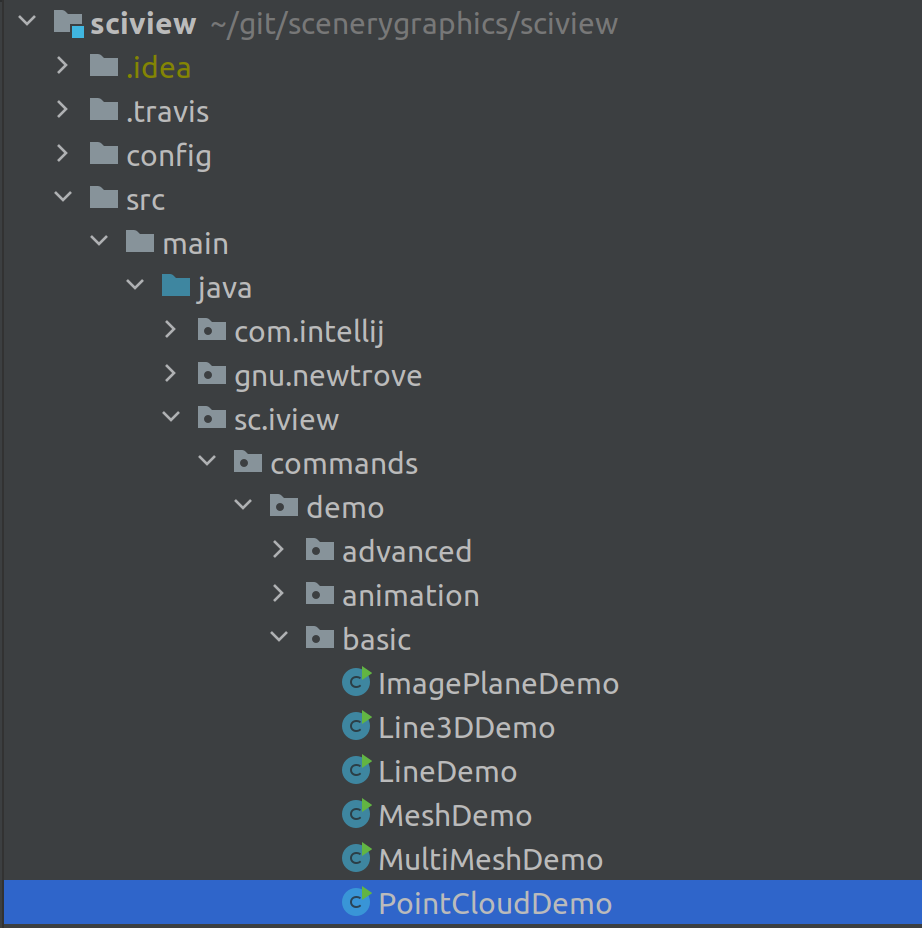
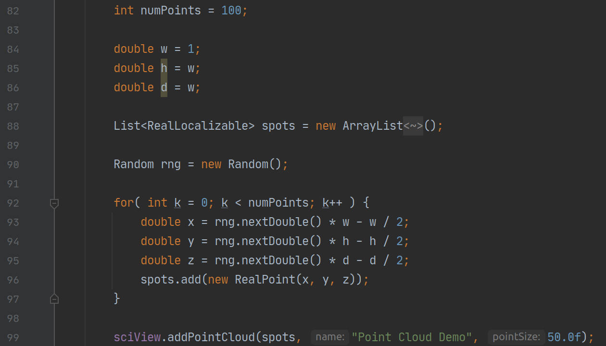

## Loading custom point clouds

Open the source tree to the PointCloudDemo. 

The core of creating a point cloud is quite simple. Here we create 100 points at random positions in the range of `(-0.5, -0.5, -0.5)` to `(0.5, 0.5, 0.5)`.

Then we add the collection of points to the scene with a point size of `50`

