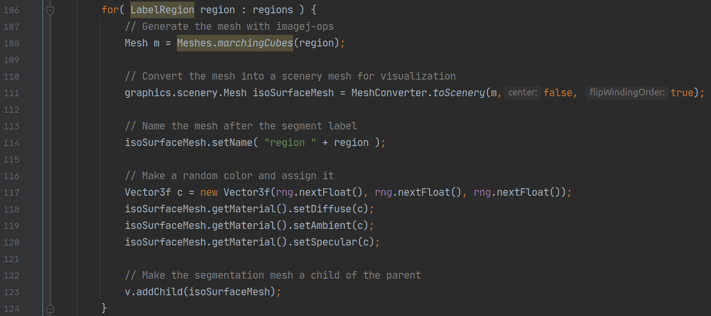

# 3D Segmentations

We will explore this demo using IntelliJ, partially because the benefit of auto-complete is quite signficant for these more complex tasks. The latest version of this demo can be found [here](https://github.com/scenerygraphics/sciview/blob/master/src/main/java/sc/iview/commands/demo/advanced/ShowSegmentationDemo.java)

This demo begins with a demo image. The details of how this image is generated aren't important, but it creates a tuneable number of spheres in random positions within a `(100,100,100)` image \(aka RandomAccessibleInterval\).

We then display this image as a volume in sciview

Now comes a key step, we perform what is called a "Connected Components Analysis" \(aka CCA\), which assigns all connected pixels to a specific label. Each of these labels represents a segmentation.

Note one nuance of this is that if 2 of our randomly generated spheres overlap, they will be treated as being connected.

An alternative would have been to use the pixel values of the image to create each `LabelRegion`. However, in practice that is not a luxury that an image analyst has.

The next thing to do is to create meshes for each segmentation label that we have created. We do this by looping over all `LabelRegion`s that we've created and computing a mesh.

