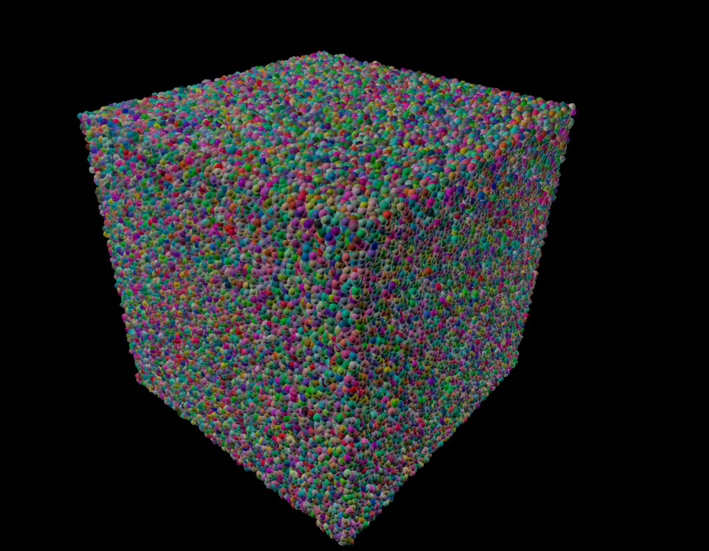

# Benchmarking

### Instancing benchmark

Sciview can display geometry in a number of ways. The normal approach is to add a node to the scene for each object you want to see. This has the advantage that you can easily manipulate and delete individual nodes from the scene. However, this does not scale well for use cases where you need to populate your scene with hundreds or thousands of the same or similar looking objects such as spheres, cones or cylinders.

Instancing allows you to render the same object from memory to multiple positions on the screen, greatly reducing render times at the expense of flexibility. You can still transform and translate each instance individually, and even give them custom properties to pass to the shader, but you lose the ability to interact with a single instance in the scene.

To test the speed differences between the conventional node publishing approach and instanced rendering, Sciview comes with a benchmark that populates the scene with a number of icospheres. You can run this benchmark as a **gradle task** from the command line, from a Sciview window (menu `Demo > Advanced`) or by running the task in Intellij IDEA from:

```
Gradle Tasks > demos.advanced > runInstancingBenchmark
```

To call the benchmark from the command line use:




```bash
./gradlew runInstancingBenchmark -Dsciview.benchmark.numParticles=20 -Dsciview.benchmark.type=instanceSequential
```





```powershell
gradlew.bat runInstancingBenchmark "-Dsciview.benchmark.numParticles=20" "-Dsciview.benchmark.type=instanceSequential"
```




There are four benchmark types available:

| Type                 | Description                                                                                                         | Time for 1000 spheres |
| -------------------- | ------------------------------------------------------------------------------------------------------------------- | --------------------- |
| `publishAll`         | Publishes a **node added event** after every single sphere creation                                                 | 20 seconds            |
| `publishOnce`        | Suppresses the node added event and publishes all changes cumulatively at the end                                   | 1 second              |
| `instanceSequential` | Uses instancing to add spheres to the scene. The loop is performed sequentially.                                    | 0.1 second            |
| `instanceParallel`   | Uses instancing to add spheres to the scene. The loop is performed in parallel by turning it into a parallel stream | < 0.1 seconds         |

The execution time is measured in milliseconds and logged to the console.

<figure><figcaption><p>Instanced geometry with 500.000 spheres. Population time: 55 seconds, rendering at approx. 5 FPS</p></figcaption></figure>
