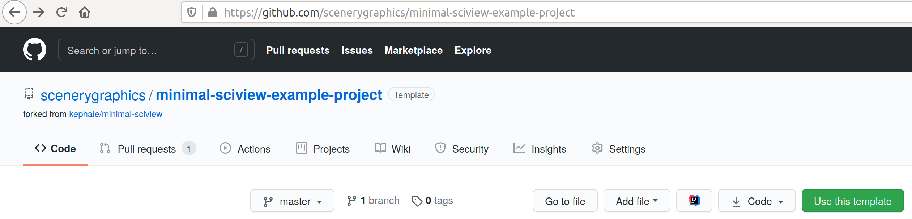
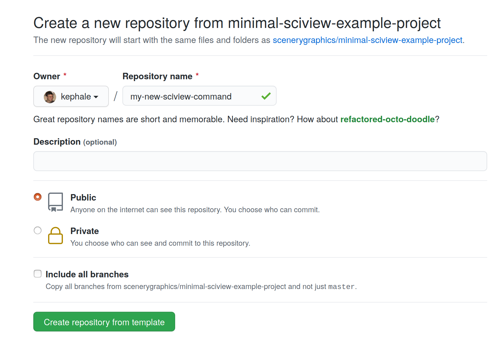
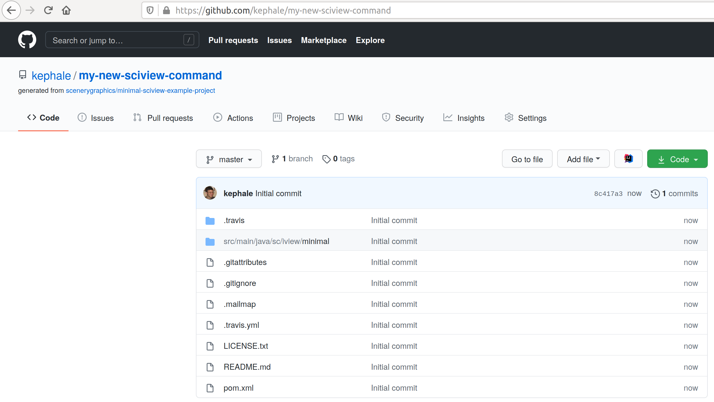
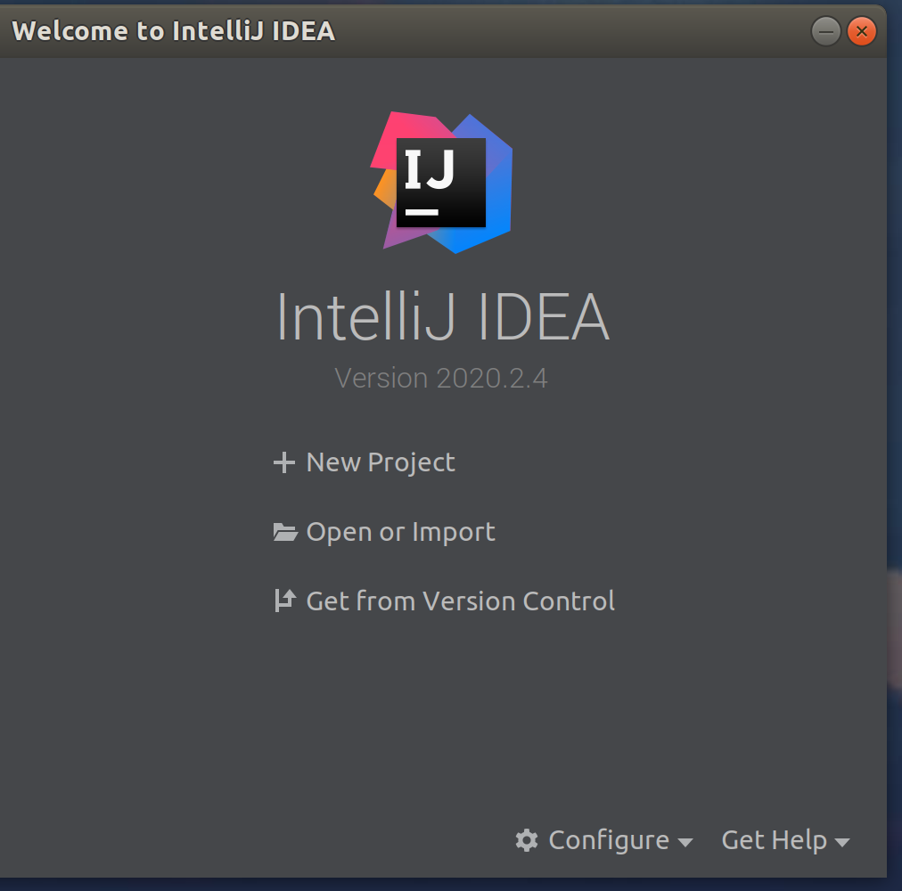
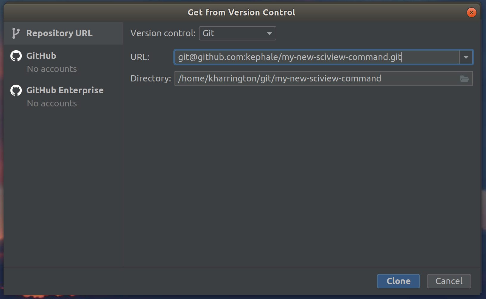
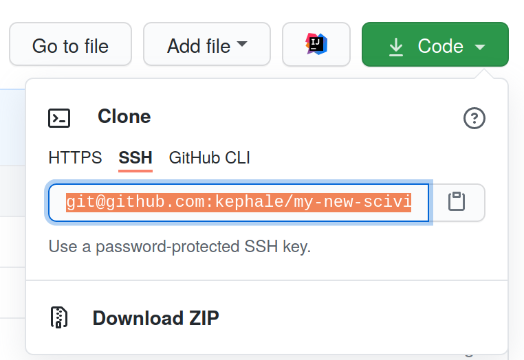
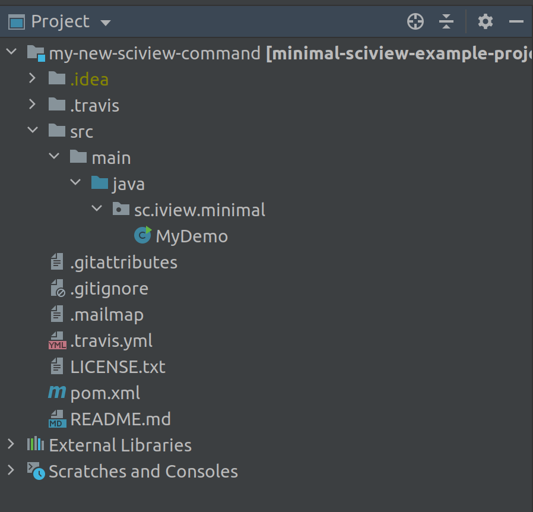
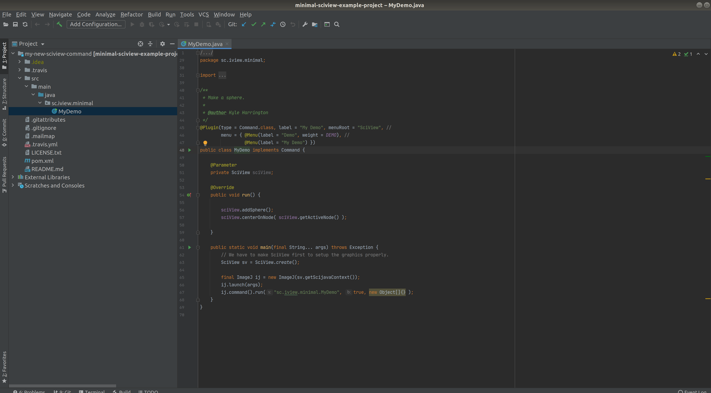
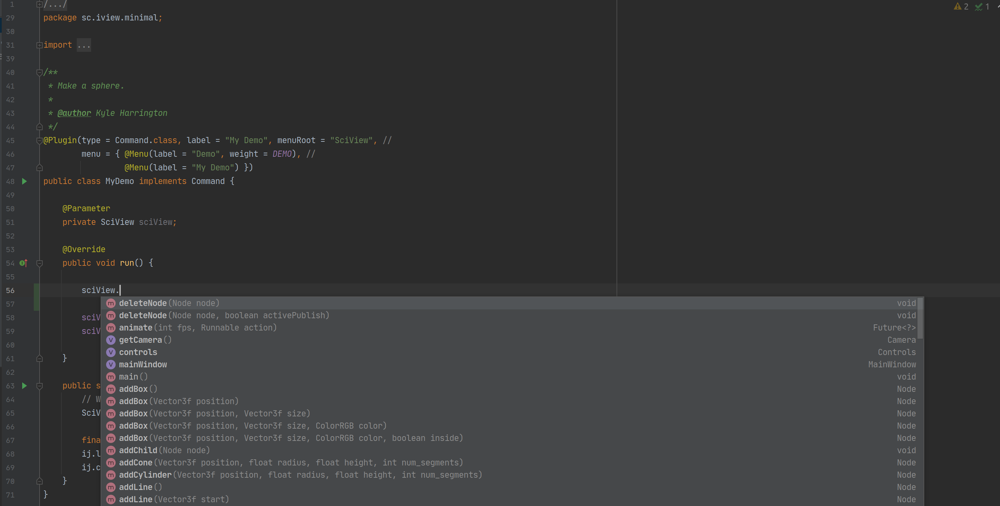

# First Demo Command

Let's start by creating a new repository on Github. In this case we suggest using an existing repository as a template:

Go to: `https://github.com/scenerygraphics/minimal-sciview-example-project`

And click "Use this template" \(shown as a green button in the image below\)

Now give your repository a name

Once you click "Create repository from template" and wait for it to complete, you will have a page like this

Now open up IntelliJ and create your new project

Click on "Get from Version Control" \(or "Open or Import" if you have already downloaded/cloned the repository\)

You can find this URL in your browser from the Github page of your repository

Almost there! Now expand the directories with your code inside IntelliJ

Open "MyDemo" and you will see the code for this command

## Tips for making your command

IntelliJ provides many additional features that can speed up your coding process, such as autocompletion of commands. Try typing `sciView.` and see the menu that shows up:

