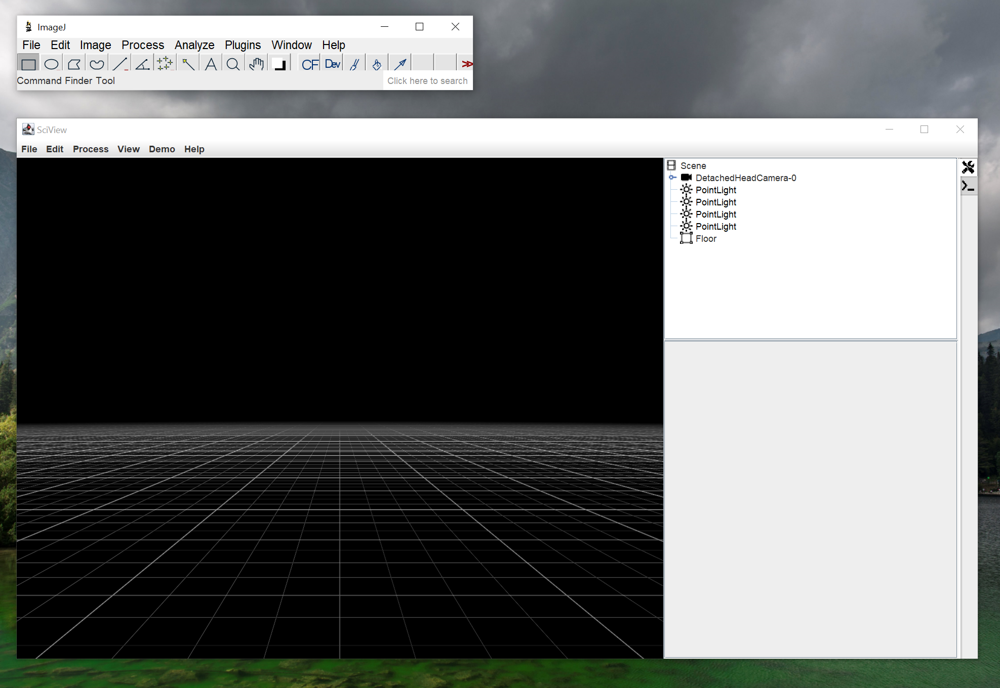
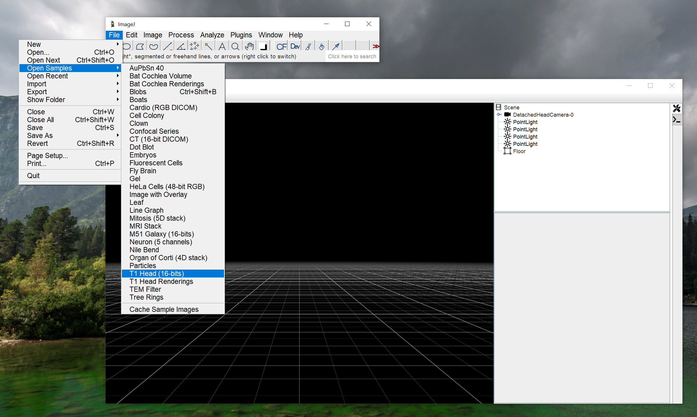
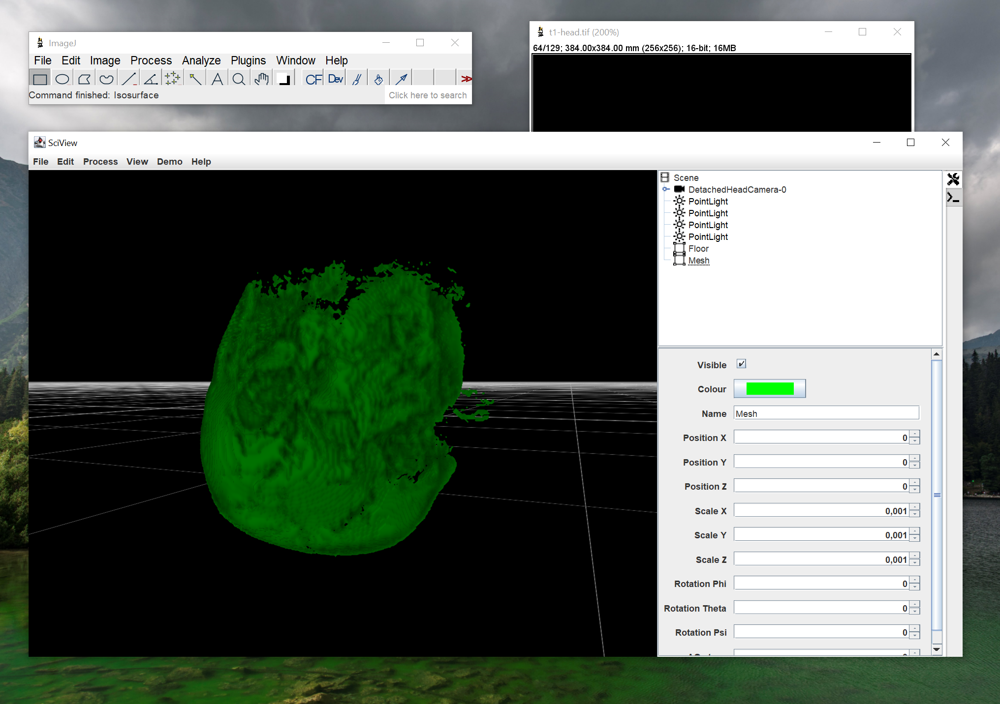

# Creating and Exporting Isosurfaces

## 1. Hi there

After opening sciview, you are presented with the main window. In case the inspector on the right is not shown, you can double-click the tool icon in the tab bar to toggle it.

## 2. Open your file

Open your file of interest from the Fiji main window. In this example, we use the `T1 Head (16-bits)`example image provided with Fiji.

## 3. Figure out the isosurface value

When hovering with the mouse over the image you've just opened, Fiji will tell you the greyscale value under the cursor in the main window. you can use this to figure out the value you would like to use for the isosurface. In this example, we use **399**.

## 4. Create the isosurface

In the sciview window, click _Process &gt; Isosurface._ This will open the window above. Enter the isosurface value you have determined. In case you have multiple images open in Fiji, these will show up in the _Image_ dropdown. Be sure to select the correct image. Then click _OK_ to create the isosurface. This might take a little while, depending on the size of the dataset.

_Note: Due to an issue with Fiji, an error might be displayed when opening the Isosurface tool. You can safely ignore this and close the console window._

## 5. Inspect the Isosurface

After sciview is done with processing, the isosurface will show up as _Mesh_ in the sciview inspector on the right. You can double-click the Mesh object and then use Shift-MouseDrag in the main window to rotate around the mesh. If you are satisfied with the result, proceed to the next step. If not, you can delete the isosurface by right-clicking on Mesh, and selecting _Delete_.

## 6. Exporting as STL

To finally export the isosurface as STL file, simply select _File &gt; Export as STL_ in the sciview main window.

