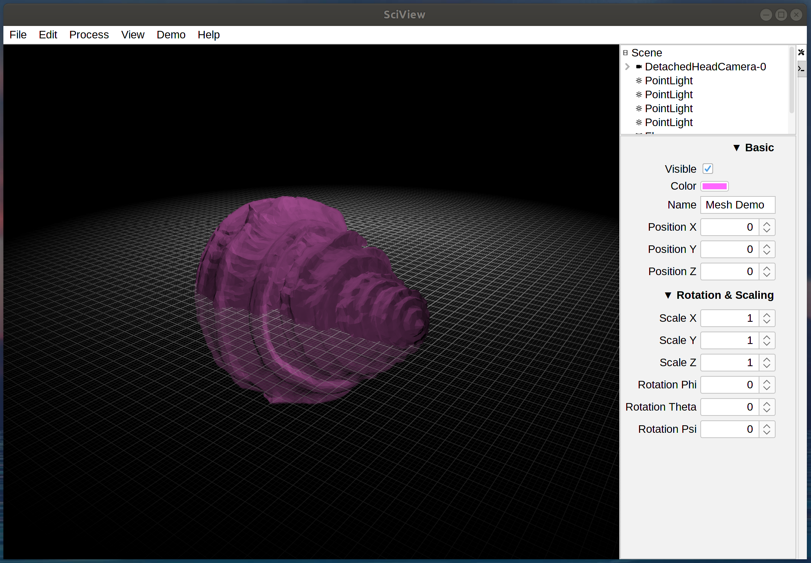
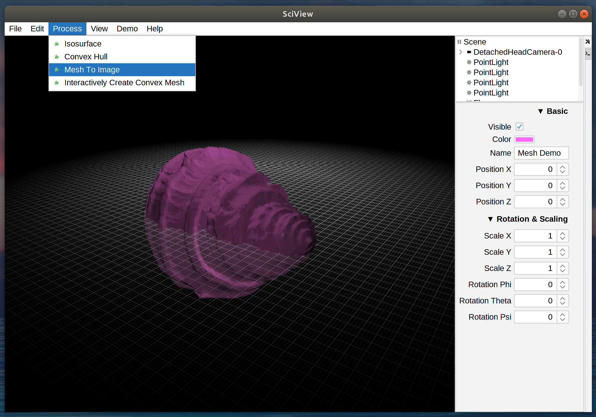
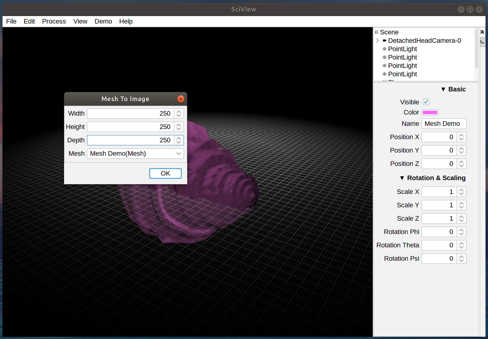
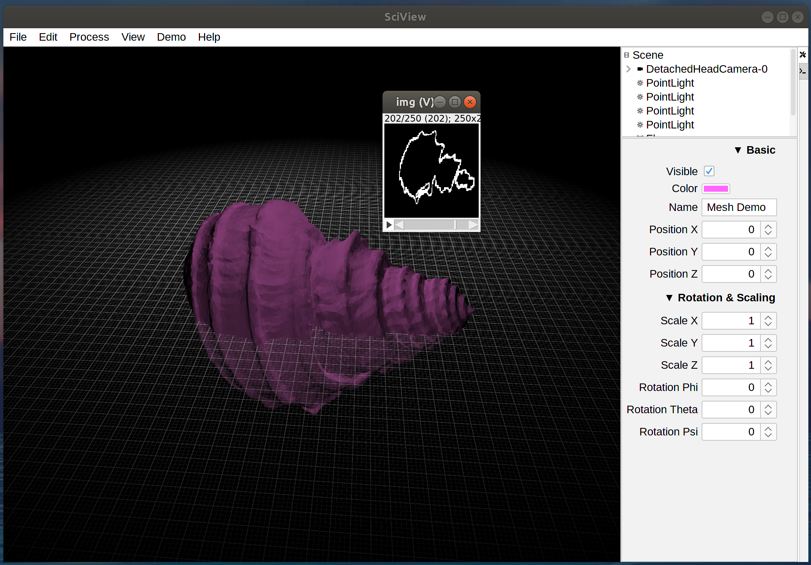

# Voxelization

Voxelization is the conversion of geometric mesh data into image data. This means you will take a mesh that represents a 3D geometry, and you will get a 3D image out.

Start by opening you mesh of choice (or select Demo>Basic>Mesh Demo)

Run the "Mesh to Image" command

You will be presented with a dialog where you tune the dimensions of your output image and can select the mesh to process (if there are multiple meshes in your scene). Note that the choice of image dimensions can have a significant impact. If you choose a size that is too small, then there is a chance that your mesh will not be "water tight," meaning that there may be gaps in the surface. On the other hand, big images can be hard to deal with.

Your resulting image will be opened as a new image within imagej

