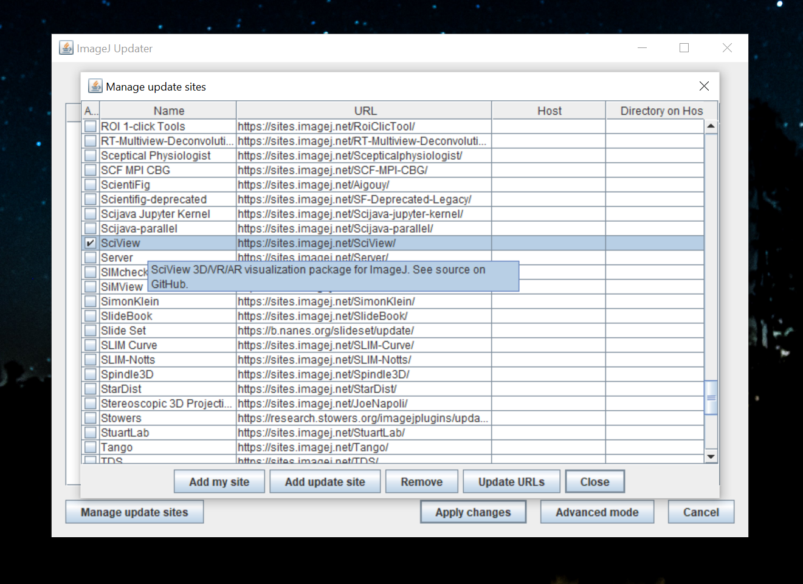
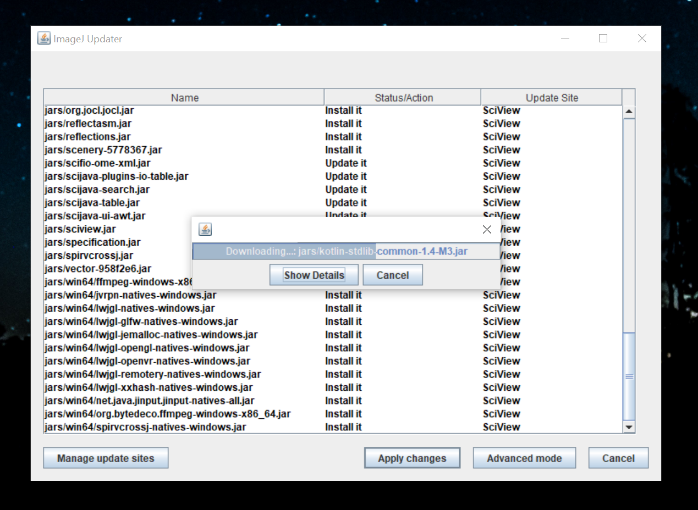
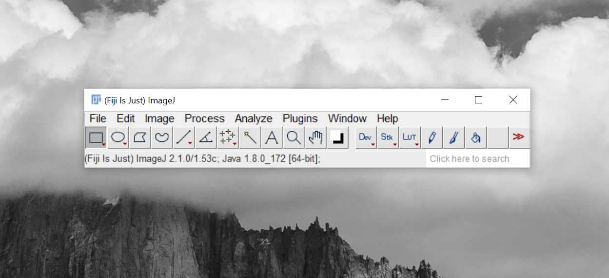
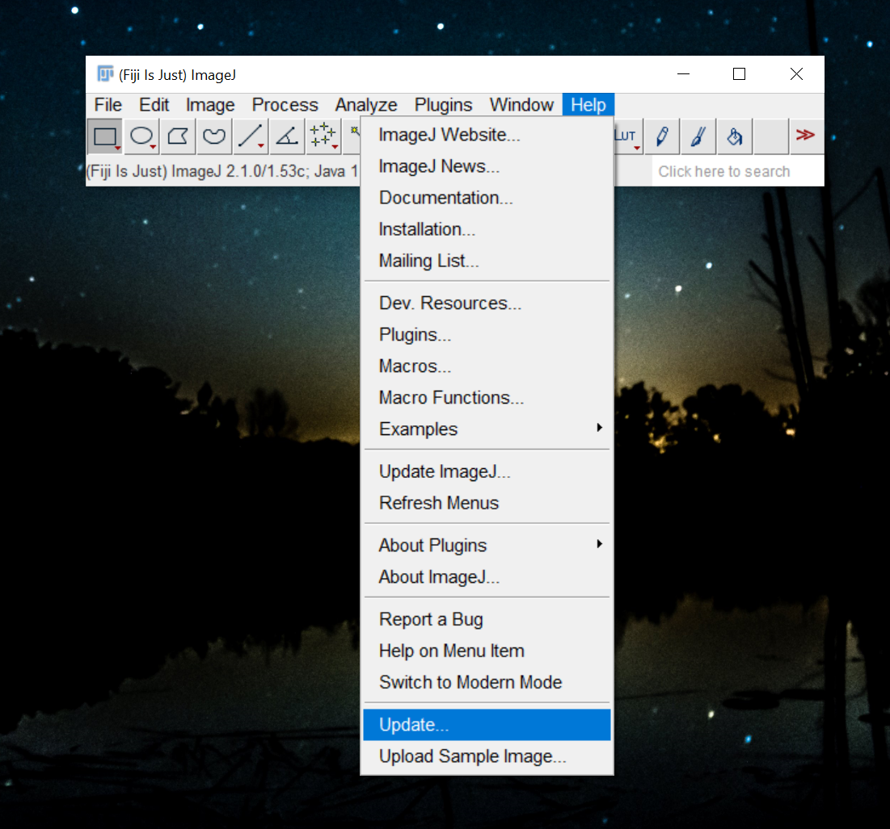
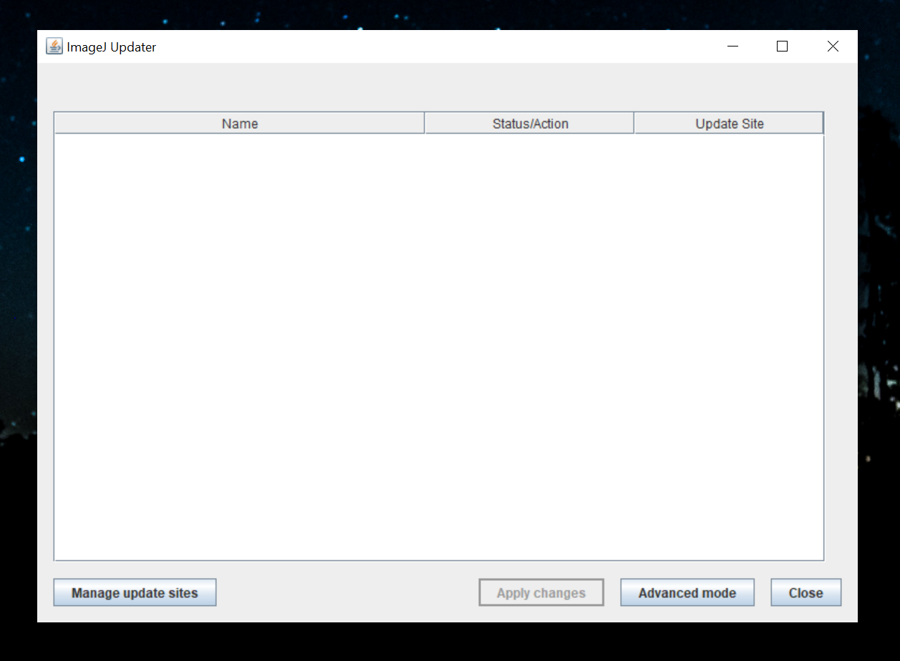
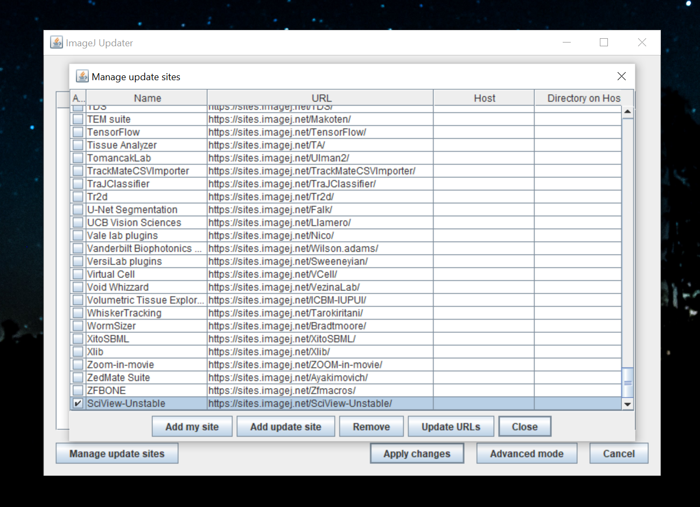
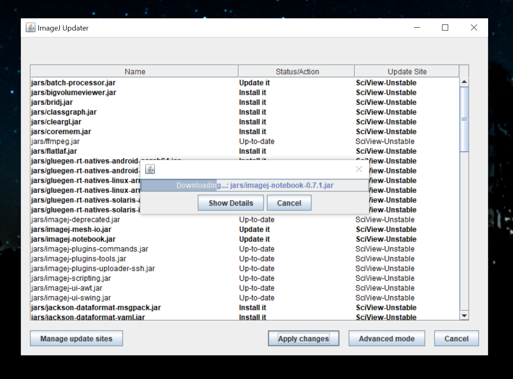
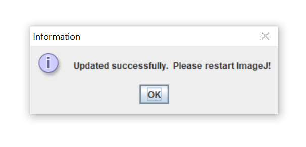

# Installing the sciview plugin for Fiji

## Installing the latest stable version

### 1. Open Fiji

If you don't have Fiji installed yet, [see the page on installing Fiji](installing-fiji.md).

### 2. Open the Fiji Updater

In the main Fiji window, click `Help` &gt; `Update...`

Fiji will scan your installation, and if necessary, suggest updates. If any updates are required, please install them before proceeding. You might need to restart Fiji in the process.

If your installation is up-to-date, the updater will show you an empty window like this:

Should there be any pending updates, please click `Apply changes`, then repeat the steps up to here.

### 3. Activating the sciview Update Site

To now install sciview, click `Manage update sites`

In the list, find the _SciView_ entry and activate it:

You can now click `Close`.  In the updater window, you will now see a list of files that the updater will download in order to download and install sciview. Click the `Apply changes` button to do that. Fiji will now download all necessary files for sciview, which might take a little moment.

### 4. Restarting Fiji

After the updater has completed downloading, you will be prompted to restart Fiji. Please do so. If you do not restart Fiji now, you will most likely run into problems.

### 5. Ready to go!

After restarting Fiji, sciview is ready to use. Find sciview under `Plugins` &gt; `sciview`.

##  Installing the latest development version

**Warning:** Using the latest development version might or might not work, so we only recommend this for experienced users who want to use the latest features or need a bugfix that is not yet present in the most current stable version.

### 0. Removing the stable version

The latest stable version of sciview \(from the _SciView_ update site\) and the latest development version \(from the _SciView-Unstable_ update site\) cannot be use simultaneously. If you want to switch from stable to development version, you need to remove the stable version first. Execute this step if you have currently activated the _SciView_ update site. Otherwise you can skip this step.

1. Open the Fiji Updater via `Help` &gt; `Update...` in the Fiji main window.
2. Click `Manage update sites`and deactivate the _SciView_ update site by removing the tick mark.
3. Click `Close`, then `Apply changes`in the updater window. The release version of sciview will now be removed.
4. Restart Fiji.

### 1. Open Fiji

If you don't have Fiji installed yet, [see the page on installing Fiji](installing-fiji.md).

### 2. Open the Fiji Updater

In the main Fiji window, click `Help` &gt; `Update...`

Fiji will scan your installation, and if necessary, suggest updates. If any updates are required, please install them before proceeding. You might need to restart Fiji in the process.

If your installation is up-to-date, the updater will show you an empty window like this:

Should there be any pending updates, please click `Apply changes`, then repeat the steps up to here.

### 3. Adding and Activating the sciview Development Update Site

To add and activate the SciView-Unstable update site that contains the latest development version, click `Manage update sites`and in the update site window, click the `Add update site` button. A new, empty list entry will appear. In the first column, enter `SciView-Unstable`, and in the second column `https://sites.imagej.net/SciView-Unstable/`. The URL is case-sensitive. Then activate the newly added update site:

Click `Close`and `Apply changes`, then Fiji will download the latest development version of sciview.

### 4. Restarting Fiji

After the updater has completed downloading, you will be prompted to restart Fiji. Please do so. If you do not restart Fiji now, you will most likely run into problems.

### 5. Ready to go!

After restarting Fiji, you can launch sciview from `Plugins` &gt; `sciview`.

