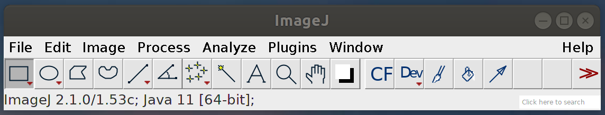
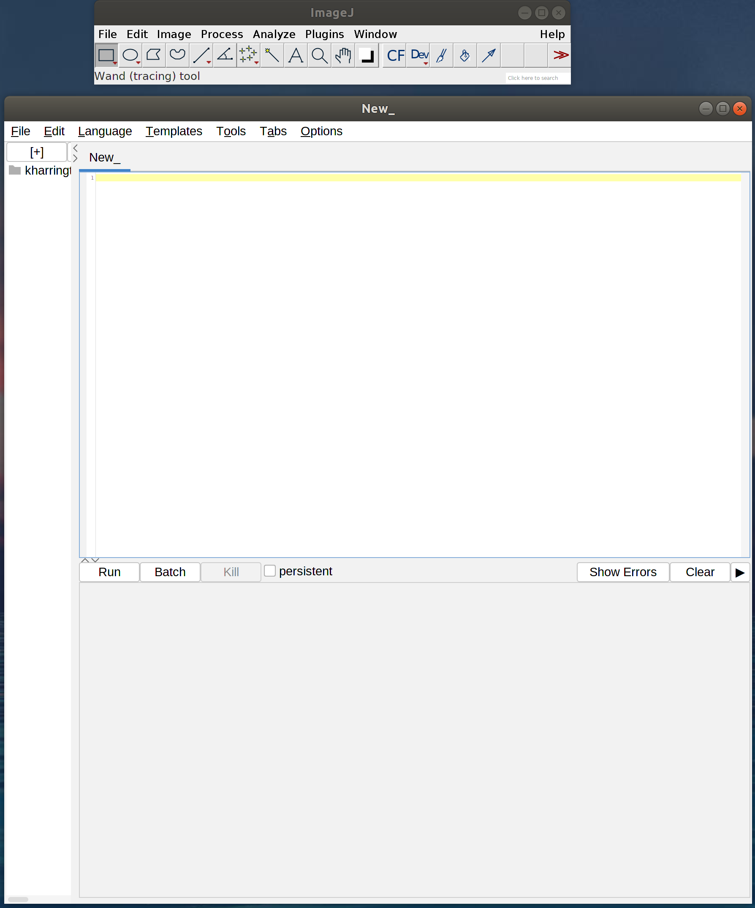
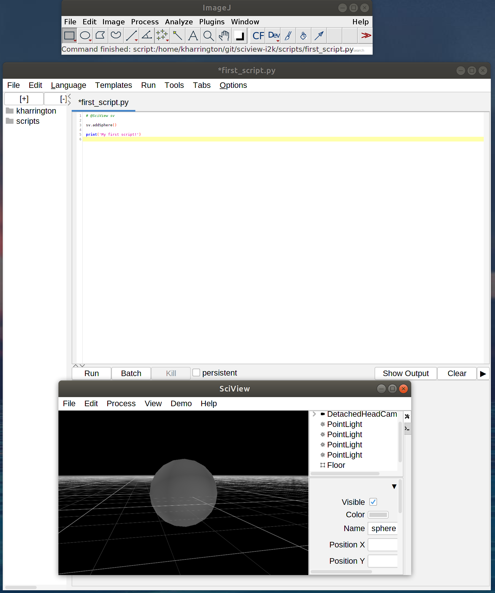

## Making your first sciview script

Start by opening Fiji and clicking on the ImageJ toolbar, then press the key '[' to open the Fiji script editor



You will get an empty Script Editor



Let's write something in Python (note to Python developers: this is "Jython" which implements a subset of Python, and does not include numpy and related libraries)

Try this:

```python
# @SciView sv

sv.addSphere()

print('My first script!')
```



But this needs some explanation, so let's go line by line

```python
# @SciView sv
```

This line means that this script needs an instance of SciView, and it will use an existing window if one already exists. The SciView instance will be named `sv`

```python
sv.addSphere()
```

This line is fairly straightforward and simply adds a new `Sphere` with default parameters, e.g. at position (0,0,0), with grey color, and a radius of 1.

```python
print('My first script!')
```

This line is normal Python code that displays "My first script!" in the console. You can use these print statements to help debug your code in more advanced scripts.

### The Interpreter

TODO
